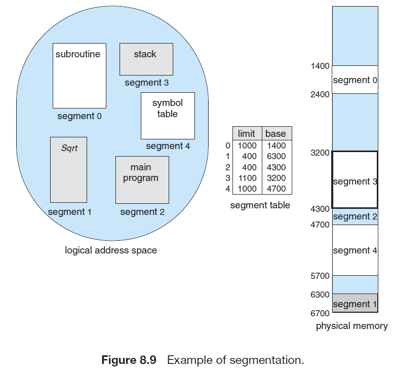
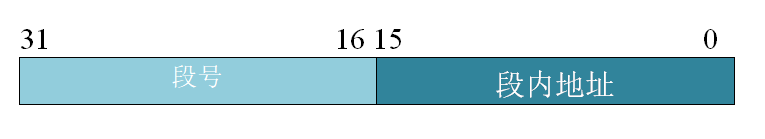

# 分段

**分段(segmentation)**是一种非连续的内存分配策略。

简单地说，分段就是在给一个进程分配地址空间时，不再是分配一整块连续的空间，而是根据进程内部的一些分块，将进程拆成数个片段，然后将这些片段装入内存中不连续的段中。

实现分段需要进程维护一个**段表(segment table)**，段表的每个条目（进程的不同片段）都有**段号**，**段基地址**（段的起始地址）和**段界限**（段的大小），如下图。

分段系统的**逻辑地址映射到物理地址**的方案如下：

任意一个逻辑地址通过一个地址寄存器映射到物理地址，该地址寄存器的总长度是机器字长，具体可以划分为段号和段内地址两部分。逻辑地址可以通过段表中的段号找到段基地址，然后通过段内地址（偏移量）找到物理内存中的精确位置。

## 例题

> 一个分段存储管理系统中，地址长度为32位，其中段号占8位，则最大段长是（）。

最大段长取决于段内地址的空间大小，即 $2^{32-8}=2^{24}B$。