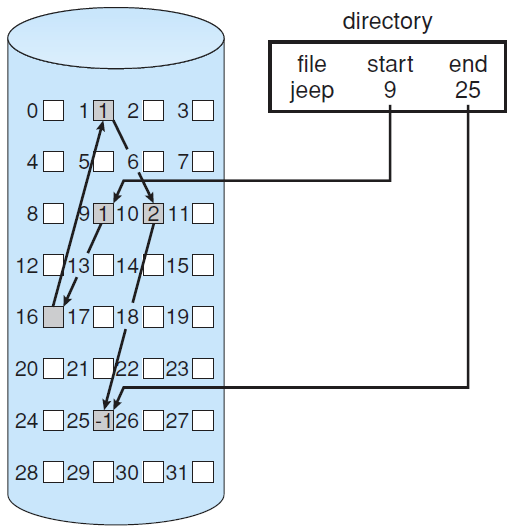
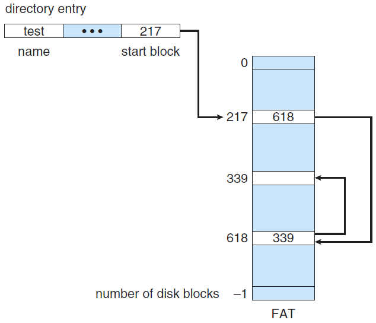
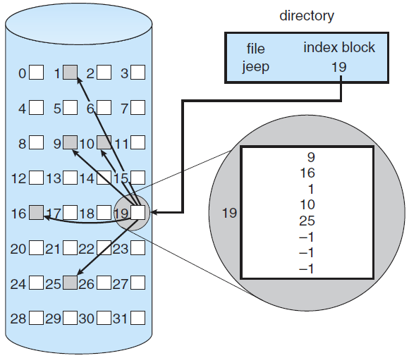
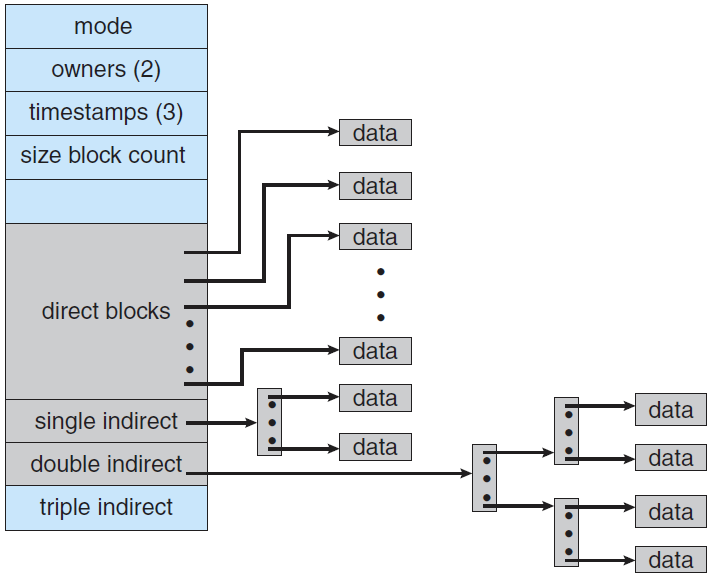
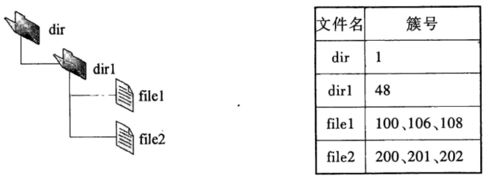
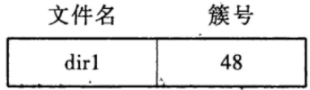
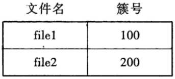

# 分配方式

这一节讨论的问题是：磁盘如何为每个文件分配空间。

## 连续分配

**连续分配(contiguous allocation)**方法要求每个文件在磁盘上占有一组连续的块。这里的连续分配可以参考内存管理中的连续分配方式。

- 优点：连续分配支持对文件的顺序访问和随机访问（直接访问），顺序访问速度快。
- 缺点：不方便文件拓展（申请新的空间可能需要开辟另一片更大的连续空间）；存储空间利用率低，会产生磁盘碎片。

## 链接分配

**链接分配(linked allocation)**中，每个文件是磁盘块组成的链表。

### 隐式链接

隐式链接中，目录项存储了每个文件在磁盘中的起始块号和结束块号（链表头和尾），文件在硬盘中的每一块都存储了指向下一块的指针，使得所有块隐式地构成一个链表。

- 优点：便于文件的扩展，加入一个块只需要修改结束块的指针，然后将结束块号修改即可。并且磁盘利用率高，没有碎片问题。
- 缺点：不支持随机访问，查找效率低。

#### 簇

链接分配的一个问题是：每一个磁盘块都需要额外开辟一块空间存储指向下一块的指针，这降低了空间利用率。这个问题的通常解决方案是**簇(cluster)**，例如操作系统定义一个簇是4个磁盘块，在磁盘上操作时以簇为单位。

### 显式链接

显示链接是指采用**文件分配表(File-Allocation Table, FAT)**，将所有链接文件的物理块的指针都存放在表中。对应文件的目录项中只需要记录文件的起始地址，每个磁盘卷的开头部分都会记录一个FAT，这个表记录了每个块指向的下一个块。因此可以通过找到文件的起始地址，然后查询FAT的方式访问整个文件。

- 优点：便于文件的扩展。磁盘利用率高，没有碎片问题。**支持随机访问**。
- 缺点：可能导致大量的磁头寻道时间（因为必须要移到开头读入FAT）。

文件分配表

## 索引分配

**索引分配(indexed allocation)**将所有的磁盘块指针放在一起，即**索引块(index block)**，解决了连接分配中随机访问效率低的问题。每个文件都有自己的索引块，索引块存储的信息称为索引表，索引表的条目 $i$ 指向文件的第 $i$ 个块，而文件对应的目录项中存储索引块的地址。

### 索引块

索引分配的一个问题是：如果文件很大，一个磁盘块可能无法存下整个文件的索引表项。解决方案为

- **链接方案**：类似链接分配。将多个索引块链接起来。

  > 该方案的缺点是：降低了随机访问的效率。实际上就是链表结构的通病，如果访问最后的链表项时间复杂度为 $O(N)$。

- **多级索引**：类似多级页表。可以令第一级的索引块指向第二级的索引块，再指向文件快。

- **组合方案（混合索引）**：其实就是一个索引块中，既有表项直接指向磁盘块，也有表项指向一个一级的索引表，还有表项指向二级的索引表……

  

  
UNIX的inode

  > 混合索引的优势：对于小文件，它可以只占用整个索引块中少量的直接索引项；随着文件增大，索引块可以逐渐将一级、二级、三级索引表项分配出去。

### 索引块常见考点

#### 磁盘I/O次数

- **链接方案**：需要先确定待访问的索引表项在链表中的位置，再加上访问数据的一次。

- **多级索引**：假设是 $k$ 级索引，访问一个磁盘块需要 $k+1$ 次磁盘I/O。

  这是因为访问索引表k次，访问数据1次。

- **混合索引**：本质上就是多级索引，主要是分析需要读取的内容是几级索引。

> 在文件的索引节点中存放直接索引指针10个，一级和二级索引指针各1个。磁盘块大小为1KB，每个索引指针占4个字节。若某文件的索引节点已在内存中，则把该文件偏移量（按字节编址）为1234和307400处所在的磁盘块读入内存，需访问的磁盘块个数分别是（）和（）。

*注意，本题中文件的索引节点已在内存中，因此访问索引块的那一次磁盘I/O是不需要的。

因为磁盘块大小为1KB，所以

- 1234所在的索引表项是 `1234 / 1024 = 1`，即第2个直接索引指针，访问磁盘块的个数为1。
- 307400所在的索引表项是 `307400 / 1024 = 301`。这里显然不是直接索引指针了，而一级索引指针最多存储 `1KB / 4B = 256` 个表项，而 `301 - 10 - 256 > 0`，所以一级索引指针也存不下307400所在的索引表项。因此访问磁盘块的个数为3。

#### 文件最大长度

> 设文件索引节点中有7个地址项，其中4个地址项是直接地址索引，2个地址项是一级间接地址索引，1个地址项是二级间接地址索引，每个地址项大小为4B，若磁盘索引块和磁盘数据块大小均为256B，则可表示的单个文件最大长度是（）。

磁盘索引块和磁盘数据块大小均为256B，因此一个索引块最多装入 `256 / 4 = 64` 个地址项。
$$
文件最大长度=(4 + 2\times 64 + 64\times 64)\times 256B=1057KB
$$

## 例题

> 下列文件物理结构中，适合随机访问且易于文件扩展的是（）。
>
> 1. 连续结构
> 2. 索引结构
> 3. 链式结构且磁盘块定长
> 4. 链式结构且磁盘块变长

连续结构就是连续分配，显然不适合文件扩展。索引结构就是索引分配，是正确答案。链式结构就是连接分配，不适合随机访问。

> 某文件系统空间的最大容量为4TB，以磁盘块为基本分配单位，磁盘块大小为1KB。文件控制块(FCB)包含一个512B的索引表区。
>
> 1. 假设索引表区仅采用直接索引结构，索引表区存放文件占用的磁盘块号。索引表项中块号最少占多少字节？可支持的单个文件最大长度是多少字节？
> 2. 假设索引表区采用如下结构：第 0～7 字节采用 < 起始块号，块数 > 格式表示文件创建时预分配的连续存储空间，其中起始块号占 6B ，块数占 2B ；剩余 504 字节采用直接索引结构，一个索引项占 6B ，则可支持的单个文件最大长度是多少字节？为了使单个文件的长度达到最大，请指出起始块号和块数分别所占字节数的合理值并说明理由。

**子问题1**：

文件系统空间的最大容量为4TB，磁盘块大小为1KB，因此一共有 $4TB/1KB=2^{32}$ 个块，因此块号至少占 $32$ 位，即4字节。

题目中给出文件控制块(FCB)包含一个512B的索引表区，因此一个索引表最多含有 $512B/4B=128$ 个表项，因此可支持的单个文件最大长度是 $128$ 个磁盘块，即 $128KB$。

**子问题2**：

第二问中，索引表采用了一种混合的结构：连续分配+索引分配，因此需要分开来讨论

- < 起始块号，块数 > 格式表示文件创建时预分配的**连续存储空间**，因此最多记录 $2^{16}$ 个连续磁盘块，即 $2^{16}KB$ 的文件。
- 一个索引项占6B，因此索引表最多有 $504/6=84$ 个表项，即索引分配部分可支持的单个文件最大长度是 $84KB$。

综上，可支持的单个文件最大长度是 $65620KB$。

为了使单个文件的长度达到最大，块数字段应该尽可能地大，由于本题中文件系统的磁盘块数总量为 $2^{32}$，因此起始块号字段至少需要 $4B$，所以块数字段为 $4B$ 时单个文件长度最大。由于此时块数字段为 $4B$，因此实际上已经可以表达全部 $2^{32}$ 个磁盘块号了。

> 文件 F 由 200 条记录组成，记录从 1 开始编号。用户打开文件后，欲将内存中的一条记录插入到文件 F 中，作为其第 30 条记录。
>
> 1. 若文件系统采用连续分配方式，每个磁盘块存放一条记录，文件 F 存储区域前后均有足够的空闲磁盘空间，则完成上述插入操作最少需要访问多少次磁盘块？F 的文件控制块内容会发生哪些改变？ 
> 2. 若文件系统采用链接分配方式，每个磁盘块存放一条记录和一个链接指针，则完成上述插入操作需要访问多少次磁盘块？若每个存储块大小为 1KB，其中 4 个字节存放链接指针，则该文件系统支持的文件最大长度是多少？

**子问题1**：

文件 F 存储区域前后均有足够的空闲磁盘空间+连续分配，说明我们只需要将原本的30~200的记录整体移动到31~201；或者将1~29的记录整体移动到0~28，然后将内存中的记录插入30。这里显然后者的I/O次数更少，因此总共需要访问磁盘块 $1+29\times 2=59$ 次（29个磁盘块的读+写和插入操作的一次写）。

连续分配下的FCB会存储文件的起始地址和文件长度，显然这两项都会变化（起始地址前移一个块，文件长度增加一个块）。

**子问题2**：

链接分配实际上就是一个单链表，因此必须从表头开始读磁盘块。访问磁盘块次数为 $29+1+1=31$ 次（从表头开始找到第30个磁盘块需要29次读磁盘块，然后将第29个磁盘块中指向一个磁盘块的指针指向一个新的磁盘块（写1次），最后将插入内容写入新磁盘块（写1次））。

若每个存储块大小为 1KB，其中 4 个字节存放链接指针。因此每个磁盘块实际上有 $1KB-4B$ 的空间给文件。同时4个字节的链接指针至多存下 $2^{32}$ 位的地址，也就是说链接分配的单链表最多有 $2^{32}$ 个表项。于是
$$
文件最大长度=(1KB-4B)\times 2^{32}=4080GB
$$

> 某磁盘文件系统使用链接分配方式组织文件，簇大小为 4KB。目录文件的每个目录项包括文件名和文件的第一个簇号，其他簇号存放在文件分配表 FAT 中。 
>
> 1. 假定目录树如下图所示，各文件占用的簇号及顺序如下表所示，其中 dir、dir1 是目录，file1、file2 是用户文件。请给出所有目录文件的内容。
>
>    
>
> 2. 若 FAT 的每个表项仅存放簇号，占 2 个字节，则 FAT 的最大长度为多少字节？该文件系统支持的文件长度最大是多少？
>
> 3. 系统通过目录文件和 FAT 实现对文件的按名存取，说明 file1 的 106、108 两个簇号分别存放在 FAT 的哪个表项中。 
>
> 4. 假设仅 FAT 和 dir 目录文件已读入内存，若需将文件 dir/dir1/file1 的第 5000 个字节读入内存，则要访问哪几个簇？

**子问题1**：

这是一个两级的目录（dir和dir1），并且采用链接分配方式，因此目录表项中需要存储每个文件的文件名和首个磁盘块地址：

- dir：
- dir1：

**子问题2**：

“FAT的每个表项仅存放簇号，占2个字节”说明最多有 $2^{16}$ 个簇，因此
$$
FAT最大长度=2^{16}\times 2B=2^{17}B
$$

$$
文件最大长度=2^{16}\times 4KB=2^{28}B
$$

**子问题3**：

文件分配表每一个块记录的是当前块指向的下一个块，所以file1的106、108分别在FAT的100和106表项中。

**子问题4**：

“仅 FAT 和 dir 目录文件已读入内存”，现在需将文件 dir/dir1/file1 的第 5000 个字节读入内存，首先需要根据dir的目录项找到dir1的簇，因此先要访问簇48。

然后，确定file1 的第 5000 个字节应该在第几个簇中：`5000 / 4K = 1`，即第2个簇，因为FAT已在内存中，我们可以根据访问簇48得到file1的首地址，然后再在FAT中直接找到file1的第二个簇是簇106。

综上，需要访问两个簇：48和106。

> 某文件系统采用索引结点存放文件的属性和地址信息，簇大小为 4KB。每个文件索引结点占 64B，有 11 个地址项，其中直接地址项 8 个，一级、二级和三级间接地址项各 1 个，每个地址项长度为 4B。请回答下列问题。 
>
> 1. 该文件系统能支持的最大文件长度是多少？（给出计算表达式即可） 
> 2. 文件系统用 1M 个簇存放文件索引结点，用 512M 个簇存放文件数据。若一个图像文件的大小为 5600B，则该文件系统最多能存放多少个图像文件？ 
> 3. 若文件 F1 的大小为 6KB，文件 F2 的大小为 40KB，则该文件系统获取 F1 和 F2 最后一个簇的簇号需要的时间是否相同？为什么？

**子问题1**：

簇大小为4KB，每个地址项长度为4B可以推出每个簇最多存 $4K/4=1024$ 个地址。因此
$$
最大文件长度=(8+1024+1024^2+1024^3)\times 4KB
$$
**子问题2**：

文件系统用 1M 个簇存放文件索引结点，用 512M 个簇存放文件数据；每个文件索引结点占 64B，一个图像文件的大小为 5600B。容易计算出这里一个图像文件需要2个簇，一个簇最多存放64个索引节点。于是
$$
文件最大数量=\min(512M/2,1M\times 64)=64M
$$
**子问题3**：

F1的大小为6KB，因此F1最后一个簇的簇号为 $6KB/4KB=1$。

F2的大小为40KB，因此F2最后一个簇的簇号为 $40KB/4KB=10$。

显然，F1可以通过直接地址项访问最后一个簇，而F2则需要通过一级间接地址（多访问一次磁盘），因此需要的时间不同。