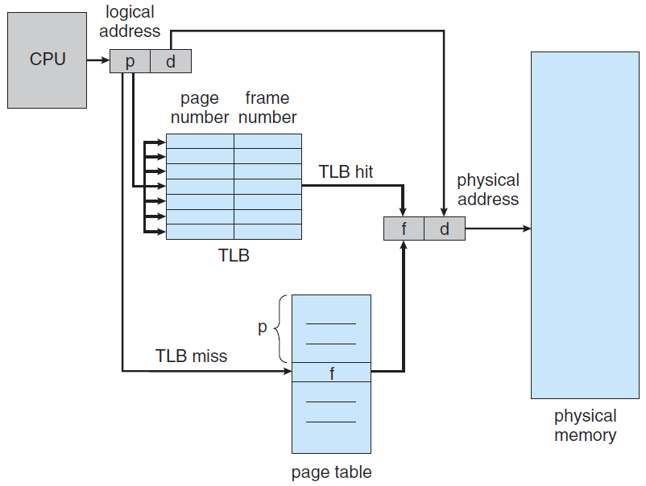
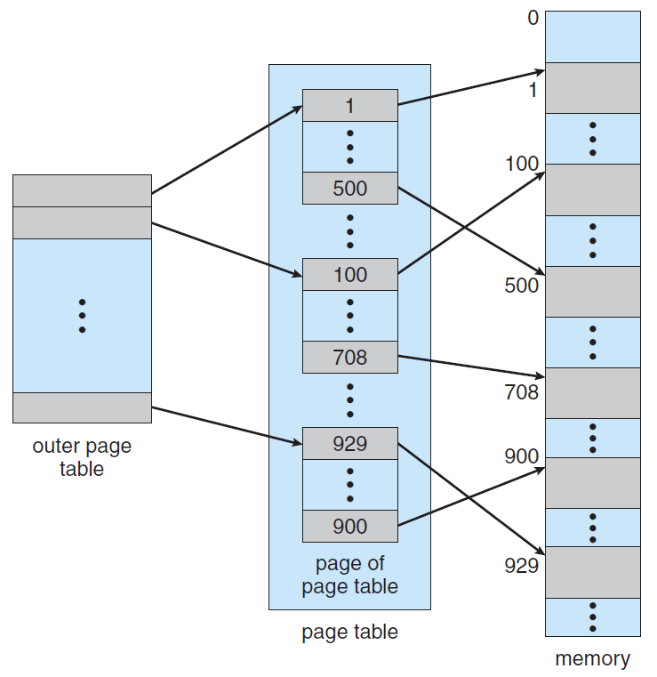
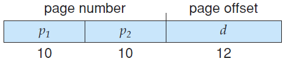

# 分页

**分页(paging)**是一种允许进程的物理地址空间非连续的内存分配方案。

实现分页的基本方法是将物理内存分为固定大小的块，称为**页框**或**页帧(frame)**，每个页框；逻辑内存也分为同样大小的块，称为**页**或**页面(page)**。

## 地址映射

分页系统将逻辑地址映射到物理地址的过程是：通过逻辑地址计算出逻辑地址的**页码(page number)**和**页偏移(page offset)**，然后以**页码**为索引，通过**页表**找到物理内存中页帧的位置，然后通过**页偏移**找到实际物理地址。

> 假设计算机系统中页面大小是50B，某进程逻辑地址空间大小是200B，则逻辑地址110对应的页号、页偏移就是
> $$
> \begin{cases}
> 页号=逻辑地址/页面大小=110/50=2\\
> 页偏移=逻辑地址\%页面大小=110\% 50=10
> \end{cases}
> $$
> 即本例中逻辑地址110对应的页号、页偏移分别是2，10。

如下图，分页系统的逻辑地址可以看作是页码+页偏移的组合。

> 页偏移的位数 $n$ 说明该系统中一个页面的大小是 $2^n$ 个内存单元（Byte）；页码的位数 $m-n$ 说明系统中一个进程最多拥有 $2^{m-n}$ 个页面。

页表由许多的页表项构成，每个页表项由**页号**和**块号**组成（页号和块号的映射实际上就是页面到页帧的映射，即逻辑地址映射到物理地址）：

页表的实际实现中，页号字段是省略的，因为页表项按照页号大小从小到大排列，因此查询任一页面的页表项都可以通过计算偏移量直接找到。也就是说，页表项实际只有块号这一项（页号是省略的字段）。

> 假设某系统物理内存大小为4GB，页面大小为4KB，则每个页表项至少应该为多少字节？
>
> 页面数量为 $4GB / 4KB = 2^{20}$，因此至少需要20位存页偏移的信息。页表项至少3字节（$24\gt 20$）。

### 分页系统实例

> 某计算机用32个二进制位表示逻辑地址，页面大小为4KB。

页面大小为4KB，机器字长32b，于是最多有 $2^{32}/4K=2^{20}$ 个页面，也就是逻辑地址的分页如下：

- **0号页面**的逻辑地址范围是 $[0,2^{12}-1]$，即 $0\sim 4095$，用二进制表示就是

  `00000000000000000000000000000000 - 00000000000000000000111111111111`

- **1号页面**的逻辑地址范围是 $[2^{12},2^{13}-1]$，即 $4096\sim 8191$，用二进制表示就是

  `00000000000000000001000000000000 - 00000000000000000001111111111111`。

- ……

> 若页面大小L为1KB，页号2对应的内存块号b=8，将逻辑地址A=2500转换为物理地址E。

$$
页号=2500/1024=2,\ 页偏移=2500\%1024=452
$$

因为页号2对应内存块号8，所以
$$
E=8\times1024+452=8644
$$

### 页表的硬件实现

页表比较小的情况下，可以将页表作为一组专用的寄存器来实现。但是现代计算机中，页表往往很大，因此页表必须存放在内存中，然后将**页表基地址寄存器用（Page-Table Base Register）**指向页表。这种方案的问题是需要访问两次内存（一次访问页表项，一次访问真实物理地址），速度较慢。

解决这个问题的标准方案是采用高速硬件缓冲，称为**转换表缓冲区**，或**快表(TLB, Translation Look-aside Buffer)**。

如上图，加入快表实际上就是在逻辑地址转物理地址时，先查询一次快表中是否已有待访存的页号，如果有就直接返回，如果没有就继续访问页表。一般而言，快表的运行机制就是：将最近访问过且不在快表中的页表项导入快表，如果快表已满就需要通过一定的替换算法替换内容。

> 访问一次快表耗时 $1\mu s$，访问一次内存耗时 $100\mu s$，若快表命中率 $90\%$，访问一个逻辑地址的平均耗时是多少？

$$
平均耗时=0.9\times (1+100)\mu s + 0.1\times (1+100+100)\mu s = 111\mu s
$$

*如果支持快表和页表的同时查询，平均耗时就是 $110.9\mu s$。

## 二级页表

### 单级页表的问题

- 单级页表占用内存空间大。

  > 以前文中“某系统物理内存大小为4GB，页面大小为4KB”为例，该系统的页表需要维护 $2^{20}$ 个页表项，假设一个页表项占4B，则该页表需要占4MB内存。

- 根据局部性原理，不需要让整个页表常驻内存。

### 二级页表

如下，一个二级页表的示例：

这个例子是一个32位逻辑地址空间的系统，页面大小是4KB。一个逻辑地址会被划分为20位的页码和12位的页偏移，其中20位的页码又会被划分为两级的页码（各10位）：

此时，逻辑地址映射到物理地址的过程是：先根据逻辑地址中的一级页码找到二级页码所在的地址块，然后再通过二级页码找到页帧，最后加上页偏移找到真实物理地址。

- 这个例子中，两级页表占用的空间是 $(2^{10}+2^{10})\times 4B$，明显小于一级页表所需的 $2^{20}\times 4B$ 空间。

## 例题

> 下列措施中，能加快虚实地址转换的是（）
>
> 1. 增大快表（TLB）的容量
> 2. 让页表常驻内存
> 3. 增大交换区（swap）

选项1正确，快表是高速缓存，增大快表容量可以提高cache命中率。

选项2正确，如果页表不常驻内存，有可能需要从外存将页表调入内存，会极大地减慢转换速度。

选项3错误。