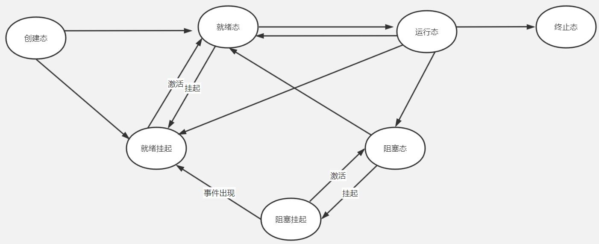
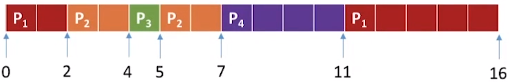
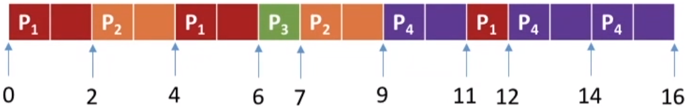
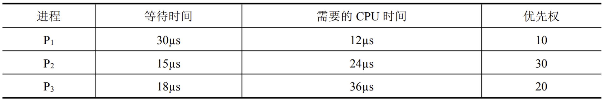

# 处理机调度

## 调度的三个层次

- **低级调度（进程调度）**：按一定原则从就绪队列中选择进程执行。
- **中极调度（内存调度）**：内存不足时，将某些内存中的进程调度到外存（空间足够时，再调回），被调到外存的进程处于“挂起态”。
- **高极调度（作业调度）**：把后备队列上的某些作业调入内存，并为之建立进程，分配其所需的资源，然后将它挂在就绪队列上（相当于是计算机根据用户输入创建进程）。

## 七状态模型

进程七状态模型

挂起态可以分为两种特殊的状态：就绪挂起和阻塞挂起。

## 进程调度的时机

操作系统进行进程调度一般有两种情况：

- 主动放弃
  - 进程正常终止
  - 运行过程发生异常而终止
  - 主动阻塞（比如等待I/O）
- 被动放弃
  - 时间片用完
  - 被更高优先级进程抢占
  - 系统有更紧急的事处理（比如等待I/O）

以下情况操作系统不能进行进程调度：

- 处理中断
- 进程工作在内核临界区中
- 原语

## 闲逛进程

当处理机无事可干时就会运行闲逛进程（idle），特性：

- 优先级最低
- 占一个完整的指令周期（指令周期末尾检查中断，判断是否有进程进入就绪队列并切换）
- 能耗低

## 调度的指标

### CPU利用率

$$
CPU利用率=\frac{CPU忙碌的时间}{总时间}
$$

### 系统吞吐量

系统吞吐量指的是**单位时间内完成作业的数量**。
$$
系统吞吐量=\frac{总共完成了多少道作业}{总共花费的时间}
$$

### 周转时间

指**从作业提交到作业完成**所经历的总时间。
$$
周转时间=作业完成时间-作业提交时间
$$

$$
平均周转时间=\frac{各作业周转时间之和}{作业数}
$$

$$
带权周转时间=\frac{作业周转时间}{作业实际运行时间}
$$

### 等待时间

指**作业等待处理机**的时间。

### 响应时间

指**从用户提交请求到系统首次产生响应**所用的时间。

## 调度算法

### 先来先服务FCFS(First Come First Serve)

按照进程到达的先后顺序调度。

> 各进程到达就绪队列的时间、需要运行的时间如下表所示，计算**先来先服务算法**的调度指标。
>
> | 进程 | 到达时间 | 运行时间 |
> | :--: | :------: | :------: |
> |  P1  |    0     |    7     |
> |  P2  |    2     |    4     |
> |  P3  |    4     |    1     |
> |  P4  |    5     |    4     |

首先进程的运行顺序显然是 `P1->P2->P3->P4`。

- **周转时间**

  P1周转时间=7，P2周转时间=7+4-2=9，P3周转时间=7+4+1-4=8，P4周转时间=7+4+1+4-5=11

- **带权周转时间**

  P1带权周转时间=7/7=1，P2带权周转时间=9/4，P3带权周转时间=8/1=8，P4带权周转时间=11/4

- **等待时间**

  P1等待时间=0，P2等待时间=7-2=5，P3等待时间=7+4-4=7，P4等待时间=7+4+1-5=7

- **平均周转时间**

  平均周转时间=(7+9+8+11)/4=8.75

- **平均带权周转时间**

  平均带权周转时间=(1+9/4+8+11/4)/4=3.5

- **平均等待时间**

  平均等待时间=(0+5+7+7)/4=5.5

### 短作业优先SJF(Shortest Job First)

短作业优先就是以作业需要的运行时间为指标，每次执行运行时间最短的作业。

> 各进程到达就绪队列的时间、需要运行的时间如下表所示，计算**非抢占式短作业优先算法**的调度指标。
>
> | 进程 | 到达时间 | 运行时间 |
> | :--: | :------: | :------: |
> |  P1  |    0     |    7     |
> |  P2  |    2     |    4     |
> |  P3  |    4     |    1     |
> |  P4  |    5     |    4     |

首先判断进程的执行顺序，应该是P1->P3->P2->P4。

- **周转时间**

  P1周转时间=7，P2周转时间=7+4+1-2=10，P3周转时间=7+1-4=4，P4周转时间=7+1+4+4-5=11

- **带权周转时间**

  P1带权周转时间=7/7=1，P2带权周转时间=10/4，P3带权周转时间=4/1=4，P4带权周转时间=11/4

- **等待时间**

  P1等待时间=0，P2等待时间=7+1-2=6，P3等待时间=7-4=3，P4等待时间=7+1+4-5=7

- **平均周转时间**

  平均周转时间=(7+9+8+11)/4=8.75

- **平均带权周转时间**

  平均带权周转时间=(1+10/4+4+11/4)/4=41/16

- **平均等待时间**

  平均等待时间=(0+6+3+7)/4=4

#### 最短剩余时间优先SRTN(Shortest Remaining Time Next)

最短剩余时间优先算法就是**抢占式的短作业优先算法**。

> 各进程到达就绪队列的时间、需要运行的时间如下表所示，计算**抢占式短作业优先算法（最短剩余时间优先算法）**的调度指标。
>
> | 进程 | 到达时间 | 运行时间 |
> | :--: | :------: | :------: |
> |  P1  |    0     |    7     |
> |  P2  |    2     |    4     |
> |  P3  |    4     |    1     |
> |  P4  |    5     |    4     |

首先判断进程的执行顺序，此时情况相对复杂，具体如下：

- **周转时间**

  P1周转时间=16，P2周转时间=7-2=5，P3周转时间=5-4=1，P4周转时间=11-5=6

- **带权周转时间**

  P1带权周转时间=16/7，P2带权周转时间=5/4，P3带权周转时间=1/1=1，P4带权周转时间=6/4=3/2

- **等待时间**

  P1等待时间=9，P2等待时间=1，P3等待时间=0，P4等待时间=2

- **平均周转时间**

  平均周转时间=(16+5+1+6)/4=7

- **平均带权周转时间**

  平均带权周转时间=(1+10/4+4+11/4)/4=169/112

- **平均等待时间**

  平均等待时间=(9+1+0+2)/4=3

### 高相应比优先HRRN(Highest Response Ratio Next)

高相应比优先算法就是以**响应比**为指标调度进程，每次选择**响应比最高**的进程上处理机。
$$
响应比=\frac{等待时间+要求服务时间}{要求服务时间}
$$

### 时间片轮转RR(Round-Robin)

时间片轮转算法就是处理机设置一个定长的时间片，每个进程轮流上处理机运行（如果某个进程运行完毕，则立刻让出处理机，不需要跑完一整个时间片）。

> 各进程到达就绪队列的时间、需要运行的时间如下表所示，计算**时间片轮转算法（时间片大小为2）**的调度指标。

这里只分析每个进程占用处理机的时间片：

### 优先级调度

优先级调度算法就是每个进程设置一个优先级的参数，每次选择最高优先级的进程执行。优先级调度可以有**抢占式**和**非抢占式**两种算法。

优先级调度还可以细分为**静态**和**动态**算法，其中动态算法就是优先级随时可以改变，而静态算法就是优先级一旦确定就不能改变。

### 多级反馈队列

1. 设置多级就绪队列，各级队列优先级从高到低（第一级队列优先级最高），每一级队列对应一个时间片大小（越高优先级的队列，时间片大小越小。一般这样分配时间片：1，2，4，8，……）
2. 新进程到达时进入第一级队列，按照先来先服务的原则排队，若该进程用完时间片还未结束，则放入下一级队列队尾。如果某个进程已经位于优先级队列最后一层，则重新放回该队列队尾。
3. 只有前k个优先级队列均为空时，才会为第k+1级优先级队列的队首元素分配时间片。
4. **多级反馈队列**是一个**抢占式**的算法。如果有更高优先级的进程，那么当前进程就会被抢占，并被放回当前队列队尾。

### 进程饥饿

饥饿（starvation）是指在并发计算中，进程一直无法获得运行所需的必要资源而发生的问题。在处理机调度中，如果某个进程可能无限地等待处理机资源，则该算法可能产生饥饿。

上述算法中，**短作业优先、最短剩余时间优先、优先级调度和多级反馈队列算法**都有可能导致饥饿。

## 例题

> 若某单处理器多进程系统中有多个就绪态进程，则下列关于处理机调度的叙述中错误的是（）。
>
> 1. 在进程结束时能进行处理机调度
> 2. 创建新进程后能进行处理机调度
> 3. 在进程处于临界区时不能进行处理机调度
> 4. 在系统调用完成并返回用户态时能进行处理机调度

选项3错误，因为只有进程处于**内核临界区**时才不能进行处理机调度，如果只是访问一般的临界资源（比如打印机）实际上是可以调度的。

选项1显然正确，选项2可能正确（优先级调度算法），选项3可能正确（优先级调度算法）。

> 下列进程调度算法中，综合考虑进程等待时间和执行时间的是（）。
>
> 1. 时间片轮转调度算法
> 2. 短进程优先调度算法
> 3. 先来先服务调度算法
> 4. 高相应比优先调度算法

高相应比算法中对于响应比的定义是
$$
响应比=\frac{等待时间+要求服务时间}{要求服务时间}
$$
因此这是一个综合考虑进程等待时间和执行时间的算法。选项4正确。

> 下列选项中，满足短作业优先且不会发生饥饿现象的是（）调度算法。
>
> 1. 先来先服务
> 2. 高相应比优先
> 3. 时间片轮转
> 4. 非抢占式短进程优先

首先，选项4可能发生饥饿，直接排除。然后，由于要求满足短作业优先，所以选择选项2（对于等待时间相同的两个作业，服务时间更短的作业响应比更高）。

> 下列有关基于时间片的进程调度的叙述中，错误的是（）
>
> 1.  时间片越短，进程切换的次数越多，系统开销越大
> 2. 当前进程的时间片用完后，该进程状态由执行态变为阻塞态
> 3. 时钟中断发生后，系统会修改当前进程在时间片内的剩余时间
> 4. 影响时间片大小的主要因素包括响应时间、系统开销和进程数量等

选项2显然错误，应该变成就绪态。

> 下列与进程调度有关的因素中，在设计多级反馈队列调度算法时需要考虑的是（）
>
> 1. 就绪队列的数量
> 2. 就绪队列的优先级
> 3. 各就绪队列的调度算法
> 4. 进程在就绪队列间的迁移条件

显然4个选项全部正确。

> 一个多道批处理系统中仅有P1和P2两个作业，P2比P1晚5ms到达,它的计算和I/O操作顺序如下:
>
> - P1：计算60ms，I/O 80ms，计算20ms
> - P2：计算120ms，I/O 40ms，计算40ms
>
> 若不考虑调度和切换时间，则完成两个作业需要的时间最少是（）。

P1先到达，因此优先开始进入第一次计算（60ms）；P1进行I/O时，P2可以抢占处理机进行计算（120ms）；P2进行I/O时（40ms），P1可以抢占处理机进行计算（20ms<40ms）；最后P2计算（40ms）。

总计60+120+40+40=260ms。

> 某系统采用基于优先权的非抢占式进程调度策略，完成一次进程调度和进程切换的系统时间开销为 1µs。在 T 时刻就绪队列中有 3 个进程P1、P2和P3，其在就绪队列中的等待时间、需要的 CPU 时间和优先权如下表所示
>
> 
>
> 若优先权值大的进程优先获得 CPU，从 T 时刻起系统开始进程调度，系统的平均周转时间为（）

根据优先权，进程的执行顺序为 `P2 -> P3 -> P1`，于是

- P2周转时间=15+24+1=40µs
- P3周转时间=18+24+36+2=80µs
- P1周转时间=30+24+36+12+3=105µs

于是平均周转时间为
$$
\frac{40+80+105}{3}=75\mu s
$$
