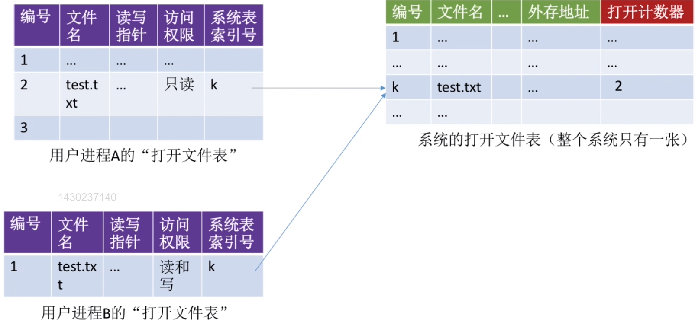

# 文件系统调用

## 创建文件

1. 在外存中申请文件所需的空间。
2. 根据文件的存放路径，在目录中创建对应的目录项。

## 删除文件

1. 根据文件路径找到对应的目录文件，然后从目录中找到文件名对应的目录项。
2. 根据目录项中记录的文件物理位置和文件大小等信息，回收文件占用的磁盘块。
3. 从目录中删除对应的目录项。

## 打开文件

1. 根据文件路径找到对应的目录文件，然后从目录中找到文件名对应的目录项。
2. 根据目录项中记录的文件读写权限判断用户是否有权限读写文件，如果拥有权限则进入下一步。
3. 将目录项复制到内存中的**打开文件表**中，用户通过该文件在打开文件表中的编号（文件描述符）指定操作的文件。

> 打开文件表是操作系统为了简化文件管理设置的一张表，放置在内存中的固定区域。除此以外，每个用户进程自带一个进程内的打开文件表，用于记录进程打开的文件。

## 关闭文件

1. 将进程打开文件表中的对应表项删除。
2. 回收分配给文件的内存空间等资源。
3. 系统打开文件表中的打开计数器减1，如果归零则删除表项。

## 读/写文件

根据读/写指针将文件数据从外存读入内存/内存写入外存。