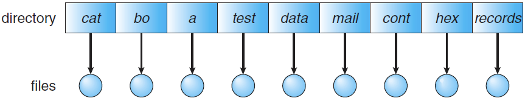
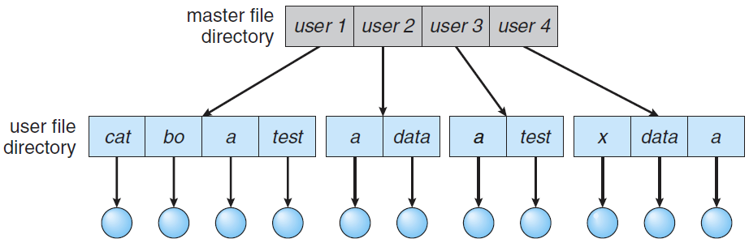
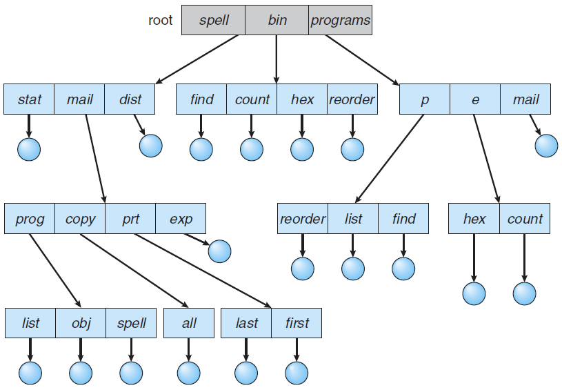
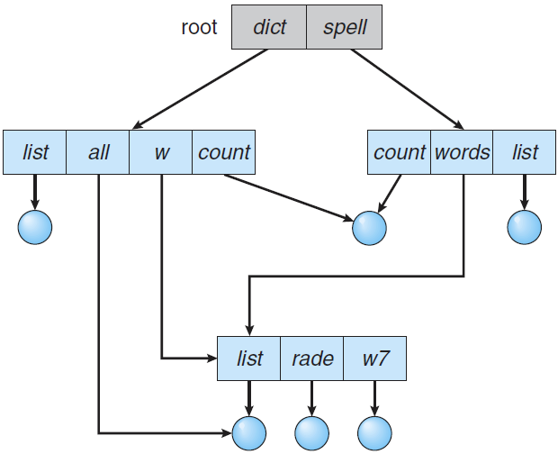

# 目录

目录本身是一个特殊的文件。目录由许多的目录项组成，这些目录项称为文件控制块（FCB），记录文件的基本信息（文件名、物理地址等）。

## 逻辑结构

### 单级目录

**单级目录**是最简单的目录结构，即所有文件都包含在同一目录中。

但是，当文件数量增加或系统有多个用户时，单级目录会出现一些问题。因为所有文件位于同一目录中，它们必须有唯一的名称，当文件数量增大时，操作系统很难跟踪海量的文件。

### 两级目录

**两级目录**就是为操作系统中每个用户创建一个单独的二级目录，每个用户都有自己的**用户文件目录(User File Directory)**。当用户作业开始或用户登陆时，搜索系统的**主文件目录(Master File Directory)**，通过用户名检索到该用户的用户文件目录。

两级目录的优缺点都是：它将用户之间隔离。优点是解决了名称碰撞问题，缺点是共享文件变得困难。

### 树形目录（多级目录）

**树形目录**允许用户创建自己的子目录，使得所有文件的组织在形式上是树形结构。树形结构中查找文件是通过路径进行的，虽然不同子目录中的文件名可以不同，但每个文件一定有不同的路径名。

引入树形目录之后，访问文件就出现了两种方式：**绝对路径**和**相对路径**，相对路径就是从当前目录开始定义一个路径，而不是绝对路径那样从根节点开始。

树形目录的缺点是不便于实现文件的共享。

### 无环图目录

**无环图目录**就是在树形目录的基础上，加入一些有向边，使得不同的子目录可以指向同一个文件。这样多个用户就可以在自己的子目录下共享同一个文件了。

无环图目录需要对每个文件设置一个共享计数器，记录有几个目录共享该文件。当任一目录的用户想要删除一个文件时，这个共享计数器减1，同时删除当前目录中的目录项，并不是直接删除文件。只有共享计数器归零时才会删除文件。

## 索引节点(inode)

目录由许多的文件控制块组成，但是目录的核心作用是文件检索，存储整个文件控制块实际上有许多的冗余信息。**索引节点(inode)**就是：每个目录项中只保存对应文件的文件名和索引节点指针，索引节点指针指向对应文件的索引节点，文件的真实信息全部存储在索引节点中。

采用索引节点后，目录存储的信息量就会大幅减少，有效提升文件检索的效率。

## 例题

> 设置当前工作目录的主要目的是（）
>
> 1. 节省外存空间
> 2. 节省内存空间
> 3. 加快文件的检索速度
> 4. 加快文件的读写速度

显然选3。设置当前工作目录可以实现相对路径，加快文件的检索。

> 某文件系统的目录项由文件名和索引节点构成。若每个目录项长度为64字节，其中4字节存放索引节点号，60字节存放文件名。文件名由小写英文字母构成，则该文件系统能创建的文件数量的上限是（）。

4字节存放索引节点号，说明一个目录最多能够同时存在 $2^{4\times 8}$ 个不同的索引节点号，而每个文件必须对应一个索引节点，因此本题的答案为 $2^{32}$。