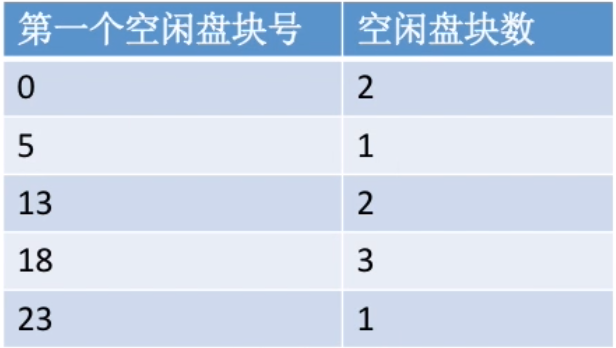
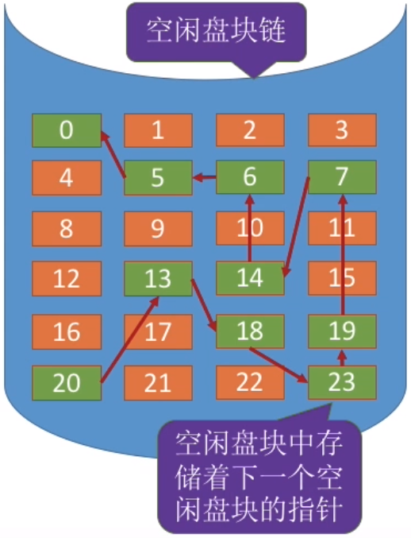
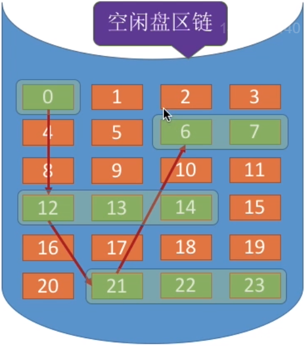
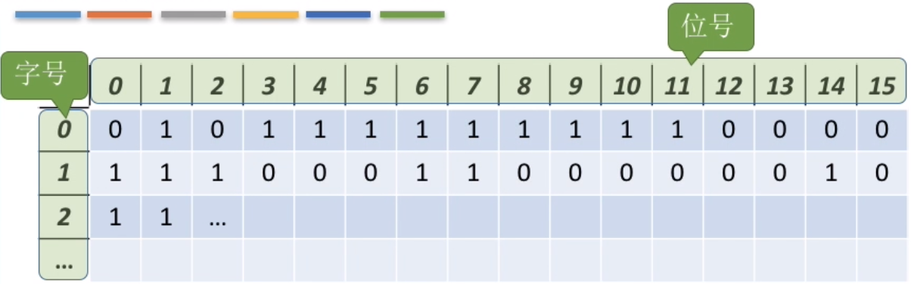
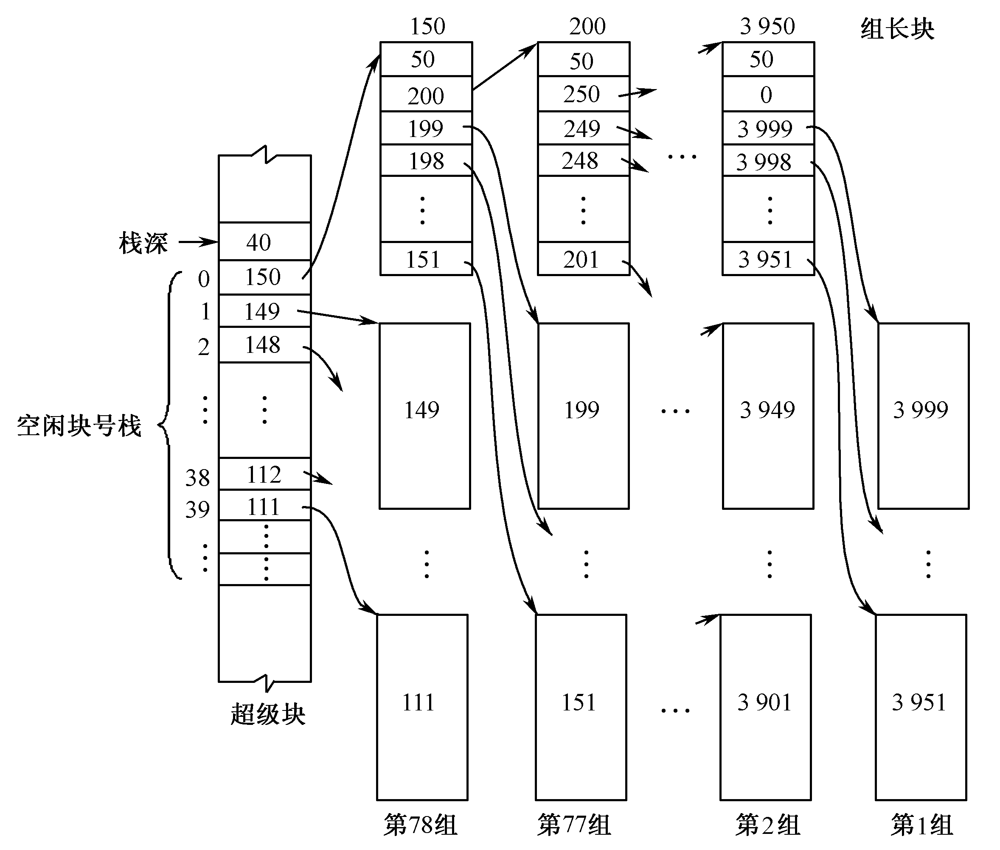

# 空闲空间管理

[分配方式](./分配方式.md)这一节说的是磁盘块如何按照一定方式分配给文件，本节则是磁盘如何管理未被分配给文件的空闲磁盘块。

## 空闲表

空闲表就是设置一个表，表项记录每个空闲的连续盘块区（第一个空闲的盘块号和该区域空闲的盘块数量）

## 空闲链表

有两种可能的链表：

- 空闲盘块链：每个空闲磁盘块链接在一起。
- 空闲盘区链：每个连续的空闲磁盘块链接在一起。

### 空闲盘块链

### 空闲盘区链

## 位向量（位视图）

位向量很容易理解，实际上就是用机器字的比特位来表示某个磁盘块是否空闲（相当于用bitset表示状态）。

如上图，就是一个机器字长16位的位向量示例：第一个字可以表示0~15号磁盘块是否空闲，第二个字可以表示16~31号磁盘块是否空闲……

## 成组链接

成组链接可以认为是一个加强版的链表：

- 这个链表由一连串可能不连续的磁盘块构成，每个磁盘块存储着以下信息：
  - 链表中下一个节点的盘块号。
  - 一个栈，这个栈中存储了空闲磁盘块的块号
  - 栈中元素个数
- 第一个磁盘块（表头）称为超级块、
- 链表中最后那个块的**栈中元素个数**为 `-1`，表示这是链表尾。

### 分配空间

当一个文件申请空间时，我们就会从超级块的链表中弹出空闲磁盘块号提供给文件，如果超级块的栈元素耗尽，则链表中下一个磁盘块成为新的超级块（这里要注意，实际上是下一个磁盘块中的内容复制到超级块中，超级块的物理地址不变）。

### 回收空间

当系统回收某个文件的空间时，回收的磁盘块块号就可以丢进超级块的栈中，如果超级栈中的元素满了，就将超级块中的元素复制到一个空闲磁盘块中，然后超级块清空并指向这个新的块。

> 其实就是记住：超级块的物理地址不变。

## 例题

> 文件系统用位图法表示磁盘空间的分配情况，位图存于磁盘的 32～127 号块中，每个盘块占 1024 个字节，盘块和块内字节均从 0 开始编号。假设要释放的盘块号为 409612，则位图中要修改的位所在的盘块号和块内字节序号分别是（）和（）。

每个盘块占 1024 个字节，即一个盘块的位图可以表示 $1024\times8=8192$ 个磁盘块是否空闲。
$$
409612\div1024=50,R=12
$$
因此盘块号为 $32+51-1=82$，块内字节序号为 $12/8=1$。

> 下列选项中，可用于文件系统管理空闲磁盘块的数据结构是
>
> 1. 位图 
> 2. 索引结点 
> 3. 空闲磁盘块链 
> 4. 文件分配表（FAT）

显然1和3正确。但是实际上，选项4也是正确的，因为FAT存储了每一个磁盘块指向的下一个块，而空闲磁盘块会用一个特殊值标记，因此也可以管理空闲磁盘块。