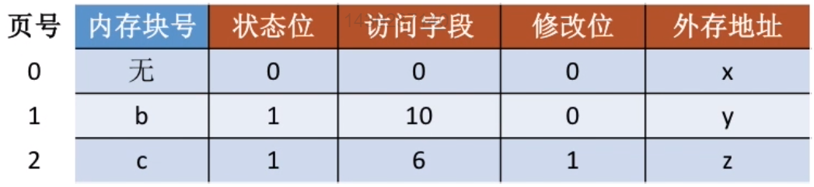
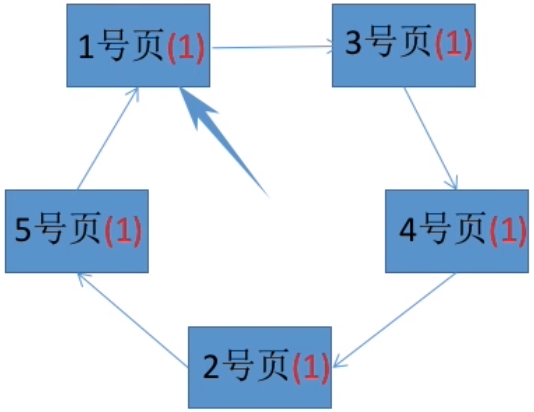
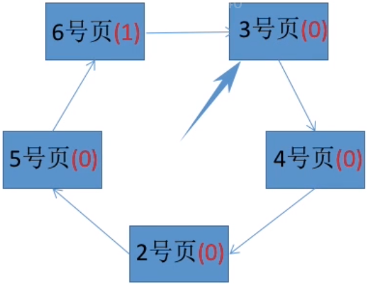
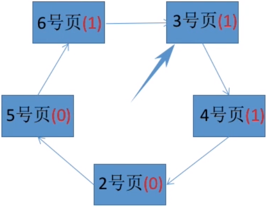
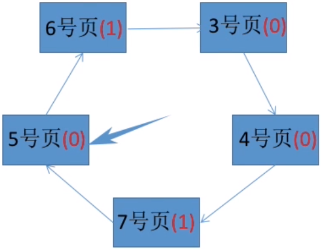

# 虚拟内存管理

## 背景

传统内存管理方式的缺点：

- 进程的数据需要一次性全部载入内存
- 进程的数据在整个运行期间都常驻内存

由于进程实际运行过程中，同一时刻只会使用全部数据中的一小部分，这会导致内存空间的极大浪费，因此引入了**虚拟内存管理**技术。虚拟内存的核心思路是：只载入进程的一部分数据到内存中而不是全部，当访问的信息不在内存时，由操作系统将信息从外村调入内存（**请求调页**）；内存空间不足时，将内存中暂时用不到的信息换出到外存（**页面置换**）。

## 请求调页

**请求调页(demand paging)**就是仅在需要时才加载页面（从外存将页面调入内存）。实现请求调页功能显然需要页表维护更多的信息，如下图所示：

页表项中多了4个字段：

- **状态位**：标记该页面是否调入了内存。
- **访问字段**：记录页面的访问信息，当内存空间不足时，操作系统根据这一字段的信息（比如最近一次访存的时间、最近访存的次数等）采用一定的页面置换算法将某些页面调出内存。
- **修改位**：标记该页面是否被修改，没有被修改过的页面不需要写回外存，可以提高性能。
- **外存地址**：记录页面在外存中的地址。

**请求调页**这一机制会在这种情况下发生：当进程的运行需要访问某一页面，且该页面在页表项中的状态位为0（不在内存中）时就会产生**缺页中断**，操作系统的缺页中断处理程序处理中断。此时缺页进程阻塞，放入阻塞队列，调页完成后再唤醒并放回就绪队列。

## 页面置换

发生**请求调页**时有两种情况：

- 内存中有空闲内存块，那么操作系统将调入的页面直接写入该空闲块即可。
- 内存中没有空闲内存块，此时操作系统需要根据一定的页面置换算法将一个“最劣”的页面替换出去。

评价一个页面置换算法的标准是**缺页率**，也就是系统发生缺页中断的次数/总的页面访问次数。

### 最佳置换算法（OPT）

**这是一种理想算法，现实中并不存在**。**最佳置换算法**就是操作系统每次选择淘汰的页面是以后永不使用的，或者在最长时间内不再访问的。

### 先进先出置换算法（FIFO）

**先进先出置换算法**就是根据页面调入内存的先后顺序排成一个队列，需要替换页面时将队首元素（最早进入内存的页面）淘汰。

> 只有FIFO算法可能产生一种意料之外的现象：**Belady异常**，它说的是当操作系统给进程分配的物理块数增大时，缺页错误率反而增加的异常现象。

### 最近最少使用置换算法（LRU）

**LRU(Least-Recent-Used)**算法就是在每次发生页面替换时，将当前所有页面中**距离前一次访问的时间最久**的页面淘汰。

> LRU算法的性能很好，但是实现较为困难，开销很大。

### 时钟置换算法（CLOCK）

**时钟置换算法**需要为每个进程维护一个“最近是否使用过”的标志位，这个标志位的取值只能是0或1（0表示最近没有使用过，1表示最近使用过）。以下是具体流程：

- 内存中所有内存块排成一个循环链表，并且有一个指针初始指向0号块。
- 每次访问一个页面后，指针向后移动一个单位。
- 每次访问一个页面后，将该页面的标志位改为1。
- 当发生缺页中断时，指针会一直向后移动，并将扫过的所有页面（标志位为1）的标志位修改为0，直到遇到第一个标志位为0的页面，将该页面替换。

> 一个例子：系统为某进程分配了5个内存块，现在需要按照以下顺序访问页面：`1 3 4 2 5 6 3 4 7`。

- 显然，前5次访问页面（`1 3 4 2 5`）都只会调入页面，不会发生替换：

  

- 访问页面6时发生了缺页中断，由于此前所有内存中所有内存块的标志位均为1，因此指针会扫一圈将所有标志位均改为0，然后回到1号页将其替换，完成6号页的访问后，指针向后移动一个单位指向3号页：

  

- 接下来访问的3，4号页均位于内存中，因此将他们的标志位改为1：

  

- 最后访问7号页又会发生缺页中断，指针会向后扫描直到2号页，然后将2号页替换，并将路径上的所有标志位（3，4号页）改为0：

  

*容易发现，时钟置换算法找到置换页面最多需要扫一整圈（标志位全为1）+1次，或者说两轮，因为在第二轮扫描时，第一个位置一定会被替换。

### 改进的时钟置换算法

**改进的时钟置换算法**加入了一个**修改**标志位，也就是说一共有两个标志位**（访问位，修改位）**。当发生替换时，如果其他条件（最近是否访问过）相同，**优先替换没有修改过的页面**以提升性能，因为没有修改的页面不需要写回外存。

算法规则是（大致类似于时钟置换算法，这里记录不同点）：

- 第一轮扫描时，指针查找向后第一个标志位是 $(0,0)$ 的页面（也就是第一个“最近既没有访问，也没有修改过”的页面）。第一轮扫描**不修改任何标志位**。
- 第二轮扫描时，指针查找向后第一个标志位是 $(0,1)$ 的页面（也就是第一个“最近没有访问，但是修改过”的页面）。并将扫过的所有页面的**访问位**置为0。
- 第三轮扫描时，指针查找向后第一个标志位是 $(0,0)$ 的页面。并且**不修改任何标志位**。
- 第四轮扫描时，指针查找向后第一个标志位是 $(0,1)$ 的页面。这一轮必定可以找到替换的页面。

## 帧分配

**帧分配**问题指的是操作系统应该怎样给各个进程分配固定数量的可用内存，例如有93个空闲帧和2个进程，每个进程应该各占多少帧？

分页存储管理中，分配给某个进程的物理内存块的集合称为**驻留集**，虚拟内存管理中，驻留集一般小于进程实际大小。

### 分配算法

最简单的分配算法就是**给每个进程分配固定数量的帧**：

- 一种最简单的分配策略是**平均分配**。

  > 例如有93个帧和5个进程，系统可以将93个帧平分给所有进程，即每个进程获得18个帧。

- 另一种容易想到的优化算法是**比例分配**。

  > 按照字面意义理解即可，操作系统会根据各个进程的大小计算出分配给每个进程的内存大小占比，按照比例分配物理内存。

也可以采用可变的分配策略：

- 当某个进程发生缺页时，系统从预留的空闲帧中分配一定数量的帧给该进程。

### 全局分配与局部分配

当进程发生缺页并且物理内存耗尽时，操作系统需要替换帧，此时有两种置换策略：

- **全局置换(global replacement)**指的是当一个进程发生缺页时，可以从**所有帧**的集合中选择一个置换帧。

  显然，当系统采用固定大小的帧分配策略时，系统并不能采用全局置换策略，因为全局置换策略会导致不同进程的驻留集大小变化（驻留集大小不可能不变）。

- **局部置换(local replacement)**指的是当一个进程发生缺页时，该进程只能从**它自己的帧**中进行选择。

## 系统抖动

如果进程需要频繁访问的页面数量大于分配到的物理内存块数，就会导致频繁的缺页中断，这种高度的页面调度称为**抖动(thrashing)**。

### 工作集模型

**工作及模型(working-set model)**基于局部性假设，采用参数 $\Delta$ 定义**工作集窗口**。它的思想是检查最近访问的 $\Delta$ 个页面，这些页面构成的集合称为**工作集**，工作集最重要的属性是集合的大小，设进程 $i$ 的工作集大小为 $W_i$，则系统总的帧需求量 $D$ 就是
$$
D=\sum W_i
$$
操作系统只需要保持分配出去的帧的总量 $\gt D$ 就可以防止抖动。

## 内存映射文件

传统的文件读写是通过 `open(), read(), write()` 系统调用进行的，主要机制是：将文件直接调入内存进行读写（因此每次文件操作都需要系统调用+磁盘访问）。**内存映射(mmap, memory mapping)**就是将文件中每个磁盘块映射到虚拟内存页面中（映射就是文件内容并没有实际导入物理内存，只是虚拟内存中存了页面相对应的物理地址），当系统需要读写对应的页面时，系统通过缺页中断自动将页面导入。

内存映射还能用来实现共享内存。

## 例题

> 在缺页处理过程中，操作系统执行的操作可能是（）
>
> 1. 修改页表
> 2. 磁盘I/O
> 3. 分配页框

选项一正确，缺页中断会调入新的页面，必定要修改页表项。

选项二正确，虚拟内存管理在发生缺页中断时，有可能需要将内存中的页面替换到外存，即发生磁盘的I/O。

选项三正确，帧分配有可能采用可变分配的策略，当进程缺页时，操作系统分配一定数量的空闲页面给缺页进程。

> 当系统发生抖动时，可以采取的有效措施是（）
>
> 1. 撤销部分进程
> 2. 增加磁盘交换区的容量
> 3. 提高用户进程的优先级

抖动发生的原因是分配给进程的物理空间小于实际需求，因此选项1正确；选项2、3错误。

> 下列关于虚拟存储的叙述中，正确的是（）
>
> 1. 虚拟存储只能基于连续分配技术
> 2. 虚拟存储只能基于非连续分配技术
> 3. 虚拟存储容量只受外存容量的限制
> 4. 虚拟存储容量只受内存容量的限制

这里选项2正确，因为连续分配技术需要将整个作业直接调入内存，虚拟存储只适用于离散情况。

选项3，4都错误，因为虚拟存储的最大容量是 `min(内存大小 + 外存大小, CPU寻址范围)`。内存大小+外存大小就是指虚拟内存最大可用空间就是整个内存，并且我们可以将外部硬盘中的全部内容导入虚拟内存。此外，调入内存的外存大小并不是没有上限的，CPU必须可以找到对应的物理地址位置，因此需要和CPU寻址范围（$2^{机器字长位数}$）取最小值。

> 若用户进程访问内存时产生缺页，则下列选项中，操作系统可能执行的操作是（）
>
> 1. 处理越界错误
> 2. 置换页
> 3. 分配内存

选项1错误，操作系统会先检查查询的页面是否越界（虚拟内存访问页面的实际顺序应该是：先查询页表，看看对应页表项是否合法，如果合法再查看状态位，如果状态位=0才说明缺页）。

选项2正确。

选项3正确，采用可变大小的帧分配策略时，系统在缺页时可能会分配更多的物理内存。

> 下列因素中，影响请求分页系统有效（平均）访存时间的是（）。
>
> 1. 缺页率
> 2. 磁盘读写时间
> 3. 内存访问时间
> 4. 执行缺页处理程序的CPU时间

请求调页就是当需要访问的页面不在内存中时，将外存中的页面调入内存。因此本题中

- 选项1正确，缺页率越低，访存时间越快。
- 选项2正确，调页操作设计内外存交换，即磁盘I/O。
- 选项3显然正确。
- 选项4正确，缺页处理程序运行越快，访存也就越快。

> 某系统采用改进型CLOCK置换算法，页表项中字段A为访问位，M为修改位。A=0表示页最近没有被访问，A=1表示页最近被访问过。M=0表示页没有被修改过，M=1表示页被修改过。按（A，M）所有可能的取值，将页分为四类：（0，0）、（1，0）、（0，1）和（1，1），则该算法淘汰页的次序为（）。

改进型CLOCK置换算法的淘汰顺序是：访问位是第一关键字，修改位是第二关键字。因此顺序为（0，0），（0，1），（1，0），（1，1）。