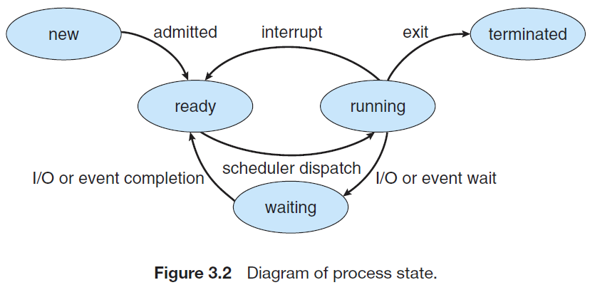

# 进程(process)

## 进程状态

- **新建(new)**
- **就绪(ready)**
- **运行(running)**
- **阻塞(waiting)**
- **终止(terminate)**

比较重要的状态转换是：

- 就绪态进程进入运行态是通过**进程调度器**调度的。
- 运行态进程在某些情况下（等待某资源为可用时，比如I/O需求）会被挂起，进入阻塞态，等操作完成后再进入就绪态。
- 当阻塞态进程等待的事件结束后（比如I/O完成，但不包括处理机空出），阻塞态进程重新变成就绪态。

## 线程

线程就是对进程的进一步细化，一个进程可以由多个线程构成，**线程是操作系统能够进行运算调度的最小单位**。

### 用户级线程

早期的操作系统并不存在进程，操作系统调度的最小单位也还是进程，此时只能通过编程手段实现近似的线程。用户级进程就是通过特殊的代码库来实现进程的细分，近似于线程的功能。但操作系统的最小单位是进程！！！

### 内核级线程

内核级线程就是操作系统内核以线程为单位进行调度。相较于用户级线程的优势就是：并发度高，当某一个线程阻塞后，整个进程中的其他线程还可以继续运行，而不是全部阻塞。

### 线程状态

线程的状态和进程非常类似，主要是三个状态：就绪态、运行态和阻塞态的相互转换（和进程完全一致）。

## 进程调度

### 三个层次

- **低级调度（进程调度）**：按一定原则从就绪队列中选择进程执行。
- **中极调度（内存调度）**：内存不足时，将某些内存中的进程调度到外存（空间足够时，再调回）。
- **高极调度（作业调度）**：把后备队列上的某些作业调入内存，并为之建立进程，分配其所需的资源，然后将它挂在就绪队列上（相当于是计算机根据用户输入创建进程）。

## 进程间通信

进程间通信有三种基本模型：**共享内存**，**消息传递**和**管道**。共享内存模型会建立一个供进程共享的内存区域，进程通过在该区域内读写数据来交换信息；消息传递模型通过在进程间交换信息来实现通信；管道则是一种“队列”通信。

### 共享内存

(a)消息队列 (b)共享内存

### 消息传递

一般认为有两种实现：**直接通信**和**间接通信**。

**直接通信**可以近似地看成在每对进程之间建立通信链路；**间接通信**通过一个中介（邮箱或者端口）来收发信息。

### 管道

管道通信就是两个进程通过“管道”（就是队列？）进行通信，相当于在通信进程间设置一个单向的队列，也就是半双工的通信。