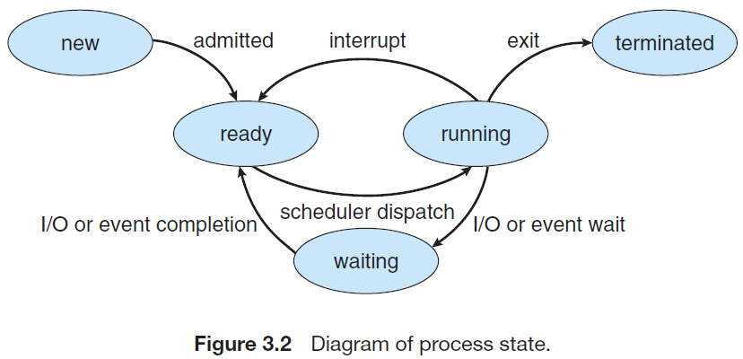

# 进程概念

## 进程定义

- 一个正在执行的程序
- 一个正在计算机上执行的程序实例
- 能分配给处理器并执行的实体

## 进程状态与转换

### 5状态模型

- **新建(new)**
- **就绪(ready)**
- **运行(running)**
- **阻塞(waiting)**
- **终止(terminate)**

进程的5状态模型

比较重要的是**中间三种状态（基本状态）就绪态、运行态和阻塞态的转换**：

- `就绪态 -> 运行态`：操作系统根据一定的调度算法，给就绪态进程分配处理机资源（分派处理机时间片）。
- `运行态 -> 就绪态`：一般有两种情况：处于运行态的进程用完了分配给他的时间片，此时该进程会让出处理机并转换为就绪态；被更高优先级的进程抢占处理机的使用权。
- `运行态 -> 阻塞态`：进程请求某一资源或等待某事件发生时就会进入阻塞态，举一些例子：I/O请求，请求外设资源（打印机之类的）的使用权等。
- ` 阻塞态 -> 就绪态`：当阻塞态进程等待的事件完成后，比如I/O操作结束等，就会重新变回就绪态。

### 例题

> 下列选项中，可能导致当前进程P阻塞的事件是（）
>
> 1. 进程P申请临界资源
> 2. 进程P从磁盘读数据
> 3. 系统将CPU分配给高优先级的进程

进程进入阻塞态的条件是：等待某一资源分配或某一事件发生，因此这里选项1、2都有可能导致进程阻塞。而选项3是更高优先级的进程抢占处理机，此时进程P会直接变成就绪态。

## 进程结构

### 进程控制块PCB

进程控制块（英语：Process Control Block，PCB）是操作系统内核中一种数据结构，主要表示进程状态。主要包括：

- 进程状态：可以是new、ready、running、waiting或blocked等。
- 程序计数器：接着要执行的指令地址。
- CPU寄存器：如累加器、变址寄存器（英语：Index register）、堆栈指针以及一般用途寄存器、状况代码等，主要用途在于中断时暂时存储资料，以便稍后继续利用；其数量及类别因计算机体系结构有所差异。
- CPU排班法：优先级、排班队列等指针以及其他参数。
- 存储器管理：如标签页表等。
- 会计信息：如CPU与实际时间之使用数量、时限、账号、工作或进程号码。
- 输入输出状态：配置进程使用I/O设备，如磁带机。
- ……

当进程创建时，操作系统会为它新建一个PCB，PCB是进程实体的一部分，是进程存在的唯一标志。

### 程序段

程序段就是能被CPU执行的程序代码段。注意一个程序可以被多个进程共享。

### 数据段

数据段可以是原始数据，也可以是程序运行时产生的中间结果。