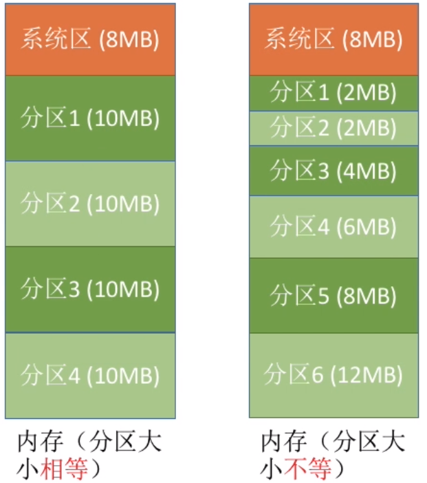
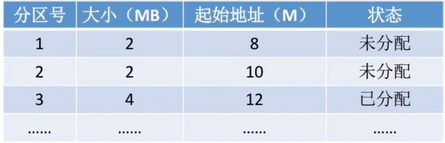

# 连续内存分配

**连续内存分配**指的是系统中每个进程位于一个连续的内存区域，与包含下一个进程的内存相连。

## 固定分区分配

### 固定分区

这是最简单的分区方法，直接将内存划分为数个大小完全相同的分区，每个分区只包含一个进程。

- 这种方案的最大缺点就是不灵活。

### 可变分区

可变分区方案就是内存划分为数个大小不同的分区，并且操作系统建立一个分区说明表，用于记录哪些内存可用。

分区说明表

- 这种方案的优点是无外部碎片；缺点是会产生内部碎片，并且可能导致太大的用户程序无法装入内存。

## 动态分区分配

动态分区就是当进程装入内存时，根据进程的大小动态建立分区。

### 首次适应

按照地址编号从低到高查找，遇到第一个可以装入进程的空闲内存块就装入进程。

> 一个“优化”：邻近适应算法。
>
> 因为首次适应算法每次都是按照地址编号从低到高查找空闲区块，可能会导致低位的内存产生较多的碎片，降低效率，因此一个改进思路就是，每一次查询新的空闲内存块都是从上一次查询的末尾开始，而不是每次都从头开始。
>
> 实现这个算法可以考虑维护一个循环链表，存入每个相邻空闲块的信息。
>
> - 但是这个算法可能导致大地址的大分区被更快用完。

- 综合来看，这是最优秀的算法，空间利用率和运行效率都比较高。

### 最优适应

查找所有的空闲内存块，将进程装入**最小且容量足够装入进程**的块。

- 空间利用率高，但是容易产生许多很小的碎片，难以被利用。并且算法的开销较大（每次都需要查找最优选的块）。

### 最差适应

分配容量最大的空闲内存块。

- 算法开销大。并且效率和空间利用率都不好。

## 碎片

- **外部碎片**：指还没有分配出去，但是由于大小太小而无法分配给申请空间的新进程的内存空间空闲块（常见于动态分配）。
- **内部碎片**：指已经被分配出去的的内存空间大于请求所需的内存空间（常见于固定分配）。

动态分配中，可以采用**紧缩(compaction)**的方案解决外部碎片，具体做法就是移动内存内容，将所有的空闲空间合并为一整块。

## 例题

> 某基于动态分区存储管理的计算机，其主存容量为55MB (初始为空闲 )，采用最佳适配(Best Fit)算法，分配和释放的顺序为 ：分配15MB，分配30MB，释放15MB，分配 8MB，分配6MB ，此时主存中最大空闲分区的大小是（）。

9MB。